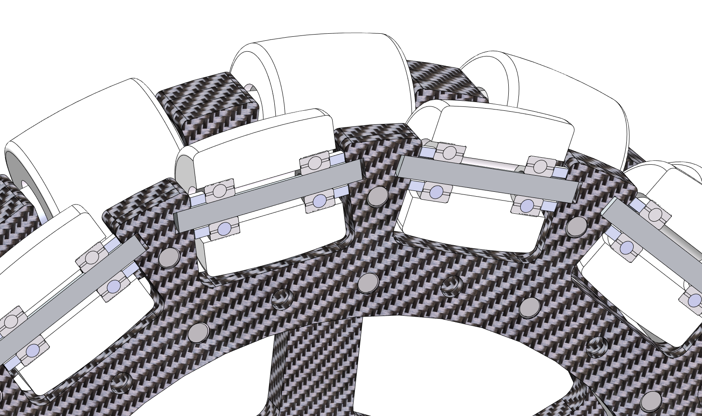
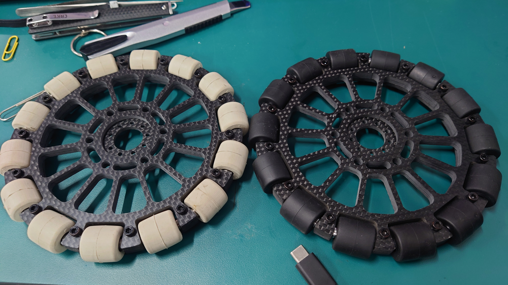

# OpenTpuOmniWheel

## 为什么做这个？

在RoboMaster比赛中，全向轮作为一种实用的底盘结构，广受欢迎。

在淘宝购买全向轮的时候，大家要么选择航发**16块钱**一个的高摩擦力、不耐用的滚子，一辆车的滚子**1792块钱**；或者是轮趣6块钱一个的又硬又没有摩擦力的滚子，属于是价格与性能不可兼得。

QQ群：704988252

## 项目介绍

我开模制造聚氨酯和橡胶材质的全向轮滚子，想让大家都能够用上物美价廉的全向轮。价格**5.5元/个**和**9元/个**，包含轴承、销钉、垫片。

图中左边是安装了自制3508P13轮毂减速器（参考自广东工业大学）的全向轮，右边是开源的适配上交联轴器的全向轮。

这次加工的滚子尺寸与**航发**的相同，用于制作直径150mm的全向轮。

滚子的销钉/轴，使用3个3mm板材夹在一起，建议使用M3\*13螺丝固定（该尺寸不常见，在佰瑞特能买到），使用M3\*14也可以。

14个滚子一组，两组滚子的碳板间距11mm。左图两组之间使用了3mm连轴板材与8mm打印件垫块，右图两组之间使用了4mm连轴板材与7mm打印件垫块。

滚子的结构如上图所示，由2个3\*8\*4轴承支撑滚子，与碳板之间是2个铝3.4\*6\*2垫片

板材堆叠后厚度为3+3+3+11+3+3+3=29mm，推荐使用M3*35螺丝进行固定。

## 性能

50A，聚氨酯耐用性会比橡胶的好；地胶上橡胶的摩擦力比聚氨酯好，光滑地面上聚氨酯摩擦力比橡胶的好。

## 全向轮步兵设计参考

[[机械设计]RM2022-南京理工大学-Alliance-机械结构开源-步兵机器人](https://bbs.robomaster.com/forum.php?mod=forumdisplay&fid=63&filter=typeid&typeid=11) 

## 购买

淘宝链接：（有问题到QQ群问，在淘宝问没法及时回复）

https://h5.m.taobao.com/awp/core/detail.htm?ft=t&id=706932589502

## 发票

淘宝订单后台申请
